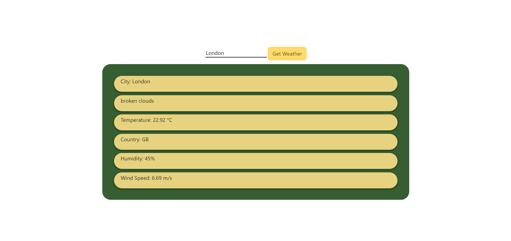

# Weather Web Application

A simple web application that allows users to get the current weather information for any city using the OpenWeatherMap API.

## Features

- Get current weather data for any city
- Displays temperature, weather description, humidity, and wind speed
- Responsive design

## Why This Project Is Useful

This project provides a quick and easy way to check the current weather for any city. It's particularly useful for travelers, outdoor enthusiasts, and anyone needing up-to-date weather information. The simple interface and reliable data from OpenWeatherMap make it a handy tool for daily use.

## Technologies Used

- HTML
- CSS
- JavaScript
- OpenWeatherMap API

## Getting Started

### Prerequisites

- A web browser
- An API key from OpenWeatherMap (sign up at [OpenWeatherMap](https://openweathermap.org/) to get your API key)

### Installation

1. Clone the repository:
    ```bash
    git clone https://github.com/your-username/weather-web-app.git
    ```

2. Navigate to the project directory:
    ```bash
    cd weather-web-app
    ```

3. Open `index.html` in your web browser.

### Configuration

1. Open the `script.js` file in a text editor.
2. Replace `YOUR_API_KEY` with your actual OpenWeatherMap API key:
    ```javascript
    const apiKey = 'YOUR_API_KEY'; // Replace with your actual API key
    ```

### Usage

1. Open the web application in your browser.
2. Enter the name of the city you want to get the weather information for.
3. Click the "Get Weather" button.
4. The weather information for the entered city will be displayed.

## Example



## Project Structure

- `index.html`: The main HTML file for the web application.
- `style.css`: The CSS file for styling the web application.
- `script.js`: The JavaScript file containing the logic for fetching and displaying weather data.

## How to Get Started

To get started with this project, clone the repository, configure your API key, and open the `index.html` file in your web browser. Follow the installation and usage instructions provided above.

## Getting Help

If you need help with this project, you can open an issue on the GitHub repository. We welcome questions, suggestions, and contributions from the community.

## Maintainers and Contributors

This project is maintained by [Muzammil Ahmed Mangrio](https://github.com/muzammil-2003). Contributions are welcome! Please feel free to submit a Pull Request.

## Contributing

Contributions are welcome! Please feel free to submit a Pull Request.

## License

This project is licensed under the MIT License. See the `LICENSE` file for more details.

## Acknowledgements

- [OpenWeatherMap](https://openweathermap.org/) for providing the weather API.

---

Feel free to customize this README file to better fit your project's specifics.
